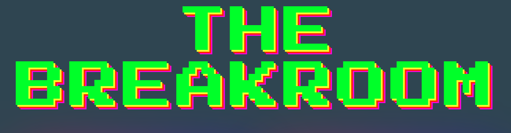

# The Breakroom

## Description

The Breakroom is the perfect time-waster webpage for those slow days in the office. Click around and enjoy the wacky animations, truly funny jokes, intriguing fortunes, and master pong battle. 

This was our first project as part of the Columbia Unviersity Coding Bootcamp and we have all learned quite a bit about collaboration via the Agile workflow, Javascript, Materialize, and the inner workings of the internet (aka CSS and HTML). 

## Installation

No installation required! This is simply a webpage. Access via this link: https://sefenydiaz.github.io/test-arcade/

## Usage

Click into one of the four game blocks to play our awesome games.  

Magic 8 Ball: Click the ball to receive a fortune! Winning lotto numbers not included.  

Jump Game: Click your mouse after the countdown to jump! This game may or may not be rigged.  

Dad Jokes: Get hilarious (very questionable) jokes and click the reaction buttons to render an appropriate gif. You can totally use this to impress your friends.  

Pong Game: Move your mouse up and down on this page to knock the 'ball' back to your virtual opponent.  

## Credits

Contributors:  

Tawhid
https://github.com/tawhidk9  

Sef
https://github.com/sefenydiaz  

Lauren
https://github.com/laurenmiller389  

LeAnne
https://github.com/branchwag  
  

  

Thank you to the below tools, resources, and APIs for helping complete our project:  

Materialize: https://materializecss.com/   

Animate CSS: https://animate.style/   

Dad Joke API:  https://rapidapi.com/Sv443/api/jokeapi-v2  

Deezer Music API: https://rapidapi.com/deezerdevs/api/deezer-1   
  

Tutorials:  

Jump Game tutorial: https://www.youtube.com/watch?v=bG2BmmYr9NQ    

Pong Game tutorial: https://www.youtube.com/watch?v=PeY6lXPrPaA  

## License

MIT License

## How to Contribute

Follow the [Contributor Covenant](https://www.contributor-covenant.org/)!

## Tests

Play each game and make sure that the magic 8 ball gives you fortunes, the games continue to provide you with accurate scores and motion. Also feel free to test out our music API and let us know if it ever stops playing our cool jams.
